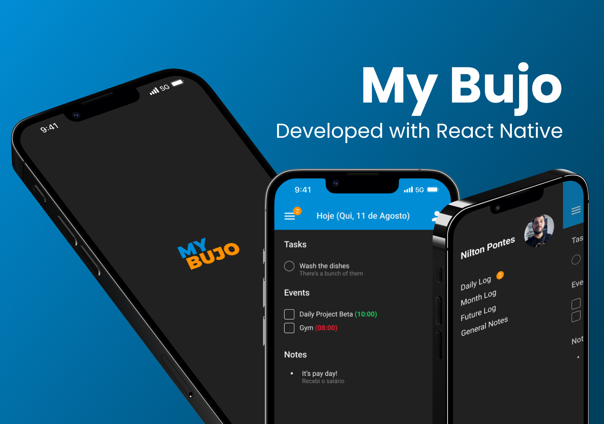

# My Bujo

* Baseado no método Bullet Journal®;
* Permite organizar o dia a dia de forma simples e livre, com alguns poucos conceitos chaves que podem ser aplicados para dar agilidade ao dia a dia;
* Compartilhar sua agenda com amigos, assim como sua performance no mês ou no ano;
* Em breve, permitirá marcar outros usuários e, assim, adicionar eventos às suas agendas compartilhadas;
* Uso de IA para reconhecimento de imagens = Phygital.



## Tecnologias Usadas

No início desse projeto pensei em utilizar Nest, Prisma e algum banco de dados relacional como o MySQL. Porém, lembrei de ter usado bibliotecas para React e React Native que interagiam diretamente com um banco de dados Firestore, e assim, preferi fazer essa integração. Desse modo, foram utilizadas:

* Frontend: React, TailwindCSS, Quill, entre outras bibliotecas;
* Mobile: React-Native, React-navigation, Moti, Styled-Components, Redux entre outras;
* Backend: ao invés de criar um servidor com node.js, como foi pensado de início, foi utilizado o Firebase e suas ferramentas.

## Download & Install - Frontend Web

Clone este repositório e, na branch "develop", acesse a pasta "frontend" e execute o comando abaixo para instalar as depencências.

```yarn```

Em seguida, execute: 

```yarn dev```

E assim, irá aparecer no terminal em qual porta o projeto está funcionando.


## Download & Install - Mobile

Clone este repositório e, na branch "develop", acesse a pasta "mobile" e execute o comando abaixo para instalar as depencências.

```yarn```

Em seguida, para executar a aplicação, possua um ambiente de desenvolvimento React Native configurado (https://reactnative.dev/docs/set-up-your-environment) e execute o comando abaixo:

```yarn android```

Desse modo, a aplicação mobile será executada em modo debug. Para executar para ios, basta substituir a palavra `android` por `ios` no comando acima.

## Para contribuir

Abra uma Pull Request para a branch "develop" com título e descrição que, em breve, irei revisá-la e estaremos trabalhando em conjunto 🥳.

PS.: Para executar o projeto com as chaves originais do firebase, por favor abra uma issue e entrarei em contato. 
